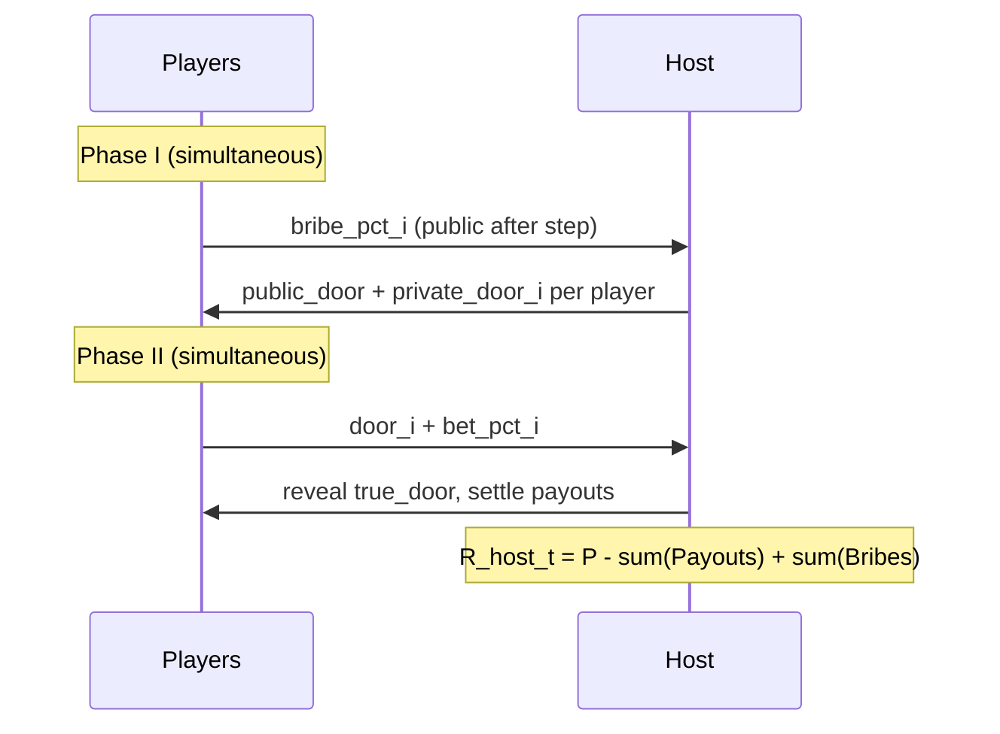

# DooRL: Strategic Information Manipulation in Multi-Agent RL

**DooRL** (4-Door RL) is a Multi-Agent Reinforcement Learning (MARL) benchmark for studying the evolution of deceptive signaling, bribery, and information asymmetry. A central **Host** (the Oracle) holds ground truth about which of four doors contains the reward, but its profit motive conflicts with the players that pay for hints.

> Formerly named *OracleGambit*. The codebase, PettingZoo id `doorl_v0`, and Python package `doorl/` use the new name.

---

## 1. Environment Dynamics: The 4-Door Game

The environment hosts **N players** and **1 Host**.

* **Setup.** There are **4 doors**; exactly one is correct each round.
* **Initial funds.** Each player starts with `initial_balance` units (default 1000).
* **Host liquidity.** The Host has unlimited funds and is **not** modeled as having a spendable wallet. Its RL reward is **per-round delta only**.
* **Payout rule.** Winning players (those who chose the correct door) receive a payout computed by the parimutuel-style dynamic-odds formula in §7. The Host *profits* iff the winning bets account for less than `payout_threshold` (`tau`) of the total pool, *breaks even* exactly at `tau`, and *loses* above `tau`.

---

## 2. Game Sequence (Two-Phase Decision)

Each round is split into two phases, each implemented as a distinct environment step (so HAPPO/PPO can assign credit cleanly across the two actions).

### Phase I — Bribery Stage

1. **Bribery.** Every player simultaneously chooses `bribe_pct_i in [0, 1]`. The absolute bribe is `bribe_i = balance_i * bribe_pct_i`. All players' balances are public, so the absolute bribes are publicly computable after Phase I.
2. **Host signaling.** The Host observes the bribes and emits:
   * a **public signal** `public_door in {0,1,2,3}`,
   * per-player **private signal** distributions; the env samples `private_door_i ~ softmax(logits_i)`.
   The Host's public and private heads are independent — any combination of truth/lie is allowed and must be discovered (not hard-coded) by the learning algorithm.

### Phase II — Betting Stage

1. **Action.** Players receive the signals and choose:
   * `door_i in {0,1,2,3}`,
   * `bet_pct_i in [0, 1]`; the absolute bet is `bet_i = clip(round(balance_i * bet_pct_i), 1, balance_i)`.
2. **Settlement.** The correct door is revealed, balances are updated, and per-round rewards are emitted (see §3.5).



---

## 3. Technical Specifications: Observations and States

All observations are fixed-shape tensors with zero/none padding (suitable for a Transformer encoder).

### 3.A Global Parameters

| Parameter | Default | Description |
| --- | --- | --- |
| `num_players` | 10 | Number of player agents `N`. |
| `NUM_DOORS` | 4 | Constant; not configurable. |
| `initial_balance` | 1000 | Starting capital for each player. |
| `payout_threshold` | 0.20 | Host break-even point `tau`. |
| `max_multiplier` | 50 | Cap on the dynamic payout multiplier. |
| `history_window` | 50 | Length `L` of the per-agent history buffer. |
| `max_rounds` | 200 | Hard episode length cap. |
| `min_bet` | 1 | Minimum absolute bet per player per round. |
| `balance_visibility` | `full` | `{full, own_only, noisy}` (see 3.B). |

### 3.B Player Observation Space

**Phase I observation (per player):**

* `balances (N,)` — normalized by `initial_balance`. Other-player entries are masked / noised per `balance_visibility`.
* `last_round_bribe_pcts (N,)`
* `last_R_player_all (N,)` — last round's per-player rewards.
* `history_buffer (history_window, F)` — see below.
* `active_mask (N,)` — 1 if still solvent.
* `own_index_one_hot (N,)` — identity feature.

**Phase II observation (per player):** Phase I obs plus

* `this_round_bribe_pcts (N,)`
* `public_signal` one-hot `(4,)`
* `own_private_signal` one-hot `(4,)`

**History row, per past round (zero-padded for episode start):**

`own_door, public_signal, own_private_signal, door_share_vec(4,), R_player_self, R_player_all(N,), x, R_host_delta, active_mask(N,)`.

### 3.C Host State Space

The Host has **full observability** of the market dynamics.

* All public state visible to players (without `balance_visibility` masking).
* `true_door` of the current round.
* Its own emitted private distributions `(N, 4)` this round.
* History of `R_host_delta`, total bribes received per round, and past emitted private distributions (for learning its own deception history).

### 3.D Action Spaces

| Agent | Phase | Action | Type |
| --- | --- | --- | --- |
| `player_i` | I | `bribe_pct` | `Box([0,1])`, Beta head. |
| `host` | sub-step | `public_door` (Discrete 4) + private logits `(N, 4)` | `Tuple(Discrete(4), Box(N*4,))`. |
| `player_i` | II | `door` (Discrete 4), `bet_pct` (Box `[0,1]`) | Tuple; Categorical + Beta. |

### 3.5 Settlement Order

```text
1. bribe_i  = balance_i * bribe_pct_i;  balance_i -= bribe_i;  host_bribe_tally += bribe_i.
2. Host emits public_door and per-player private distributions; env samples private_door_i.
3. bet_i = clip(round(balance_i * bet_pct_i), 1, balance_i);  balance_i -= bet_i;  P += bet_i.
4. Reveal true_door;  x = W / P;  m = min(1 + alpha / x, max_multiplier);  winners' balance_i += bet_i * m.
5. R_player_i = (Payout_i - bet_i - bribe_i)   # Payout_i = 0 if wrong door
6. R_host    = P - sum(Payouts) + host_bribe_tally
```

### 3.6 Edge-Case Modes (all configurable)

| ID | Default behavior |
| --- | --- |
| E1 (`W = 0`) | Host keeps `P`; no payouts; `x` logged as 0. |
| E2 (`balance < 1`) | Player skipped this round (`bet_i = 0`, `R_player_i = 0`); `active_mask_i = 0`. No respawn. |
| E3 (`true_door`) | Uniform random `{0,1,2,3}` each round. |
| E4 (episode end) | `max_rounds = 200` (configurable). Early-terminate when all players bankrupt. |
| E5 (multiplier cap) | `max_multiplier = 50`. |
| O1 | Other players' current-round bets not visible until aggregate door share is logged post-round. |
| O2 | Public vs private signal freely chosen by Host (any truth/lie combination). |
| O3 | Other players' private signals never visible; per-player past `R_player_all` is visible. |

---

## 4. Reward Shaping

### Player reward (per round)

\[ R_{\text{player},i} = \text{Payout}_i - \text{bet}_i - \text{bribe}_i \]

with `Payout_i = bet_i * multiplier(x)` for winners and `0` otherwise.

Players must learn whether the "information gain" from a bribe justifies its cost.

### Host reward (per round, delta only)

\[ R_{\text{host}} = P - \sum_j \text{Payout}_j + \sum_i \text{bribe}_i \]

The Host's RL objective is the **per-round delta**; long-horizon credibility-vs-survival behavior comes through the discount factor `gamma` rather than a cumulative-wealth observation.

---

## 5. Model Architecture: Hierarchical Transformer

Player and Host policies each use a **hierarchical Transformer encoder** with dual-stage heads.

### 5.A Player policy

| Hyperparameter | Default | Sweep |
| --- | --- | --- |
| `d_model` | 128 | yes |
| `n_layers` | 2 | yes |
| `nhead` | 8 | yes |
| `dim_ff` | 256 | yes |
| `dropout` | 0.1 | no |
| Door embedding | 8 | no |
| `history_len` | 50 | yes |

Heads:

* Phase I: `bribe_pct` ~ Beta(α, β).
* Phase II: `door` ~ Categorical(4), `bet_pct` ~ Beta(α, β).

The Phase II forward pass appends the just-emitted `public_signal` + `own_private_signal` as a "current-round" token.

**`parameter_sharing` modes:**

* `encoder` (default) — single shared transformer trunk + per-player heads + per-player ID embedding.
* `none` — N independent transformers (ablation).
* `full` — single policy; identity injected as token (ablation).

### 5.B Host policy

A Transformer over per-player tokens + a CLS-style global token. Heads:

* `public_door` ~ Categorical(4) from the CLS token.
* Per-player private logits `(N, 4)` from a **shared per-player head** applied to each per-player token (parameter sharing internal to the Host policy, regardless of player `parameter_sharing` mode).

---

## 6. Research Hypotheses

Replacing the earlier vague research questions, the project commits to the following falsifiable hypotheses. Each is paired with a metric (see §9).

* **H1.** Mean `bribe_pct` at convergence is monotonically increasing in `payout_threshold` (higher Host risk tolerance → greater willingness of players to pay for information).
* **H2.** At convergence, `MI(private_signal_i, true_door) > MI(public_signal, true_door)` (the private channel carries more information than the public channel).
* **H3.** Players in the top quartile of `bribe_pct` achieve **at least 1.5×** the end-of-episode balance of bottom-quartile bribers when the Host is co-trained; no such gap appears against a scripted truthful Host.
* **H4.** The rate of `(public = true_door, private ≠ true_door)` rounds drops below **5%** after convergence — the Host actively learns that "publicly tell the truth, privately lie" is dominated.

---

## 7. Payout & Reward Mechanism

The reward mechanism is a **dynamic-odds (parimutuel-style) game** in which the per-winner multiplier shrinks as more pool volume bets on the correct door.

### 7.A Definitions

* `P` — total pool (sum of all bets in the round).
* `W` — winning volume (sum of bets on `true_door`).
* `x = W / P` — winning ratio.
* `multiplier(x)` — multiplier applied to each winning bet.

### 7.B Generalized Payout Formula

\[ \text{multiplier}(x) = \min\!\left(1 + \frac{\alpha}{x},\ \text{max\_multiplier}\right), \quad \alpha = 1 - \text{tau} \]

\[ \text{Payout}_i = \text{bet}_i \cdot \text{multiplier}(x) \]

* At `x = tau`, total payouts equal `P` (Host break-even on the pool, before bribes).
* For `x < tau`, total payouts are less than `P` → Host profits.
* For `x > tau`, total payouts exceed `P` → Host loses on the pool but may still net positive after bribes.

The cap `max_multiplier` is a numerical-stability guard against extreme tails when very few players win with very small bets. It is configurable and sweepable.

### 7.C Host Net Profit/Loss (per round)

\[ R_{\text{host}} = P - \sum_j \text{Payout}_j + \sum_i \text{bribe}_i \]

### 7.D Illustrative Strategic Scenarios at `tau = 0.20`, `max_multiplier = 50`

| Winner ratio `x` | Multiplier | Host outcome (pool only) |
| --- | --- | --- |
| 0.05 | 17× | Strong profit (`+0.15 P`) |
| 0.20 | 5× | Break-even (0) |
| 0.50 | 2.6× | Loss (`-0.30 P`) |

---

## 8. Expected Behavioral Evolutions

1. **Host manipulation.** The Host learns that providing too much accurate information drives `x > tau`, causing a loss. It must distribute false signals or steer different players toward different doors to hold `x` near or below `tau`.
2. **Player skepticism.** Players learn that crowding behind a door collapses the multiplier and that the Host's incentive to lie scales with consensus.

These are predictions for H1–H4 to confirm or refute.

---

## 9. Evaluation Protocol

### 9.A Metrics (logged every `eval_interval`)

* `R_host` per round (mean, std); cumulative Host P&L (analysis only).
* `x` distribution and median vs `tau`.
* Mean player end-of-episode balance; bankruptcy rate.
* Mean `bribe_pct`; correlation between `bribe_pct` and `private_signal == true_door`.
* Entropy of door bet distribution (crowding).
* `MI(private_signal_i, true_door)` and `MI(public_signal, true_door)` via binned-estimator.
* P(player follows private signal); P(player follows public signal).
* Per-player and aggregate variants of every metric (population-diversity reporting, R-T3).

### 9.B Baselines

* `random_host` vs random players.
* `truthful_host` vs learned players.
* `noisy_truthful_host` (public always true, private noise scales with bribe) vs learned players.
* Learned host vs `greedy_players` (max bet on public signal).
* Learned host vs `no_bribe_players` (always `bribe_pct = 0`).

### 9.C Acceptance Targets (used by `eval.py` for pass/fail)

* Mean `R_host > 0` over 500 eval episodes at `payout_threshold = 0.20`.
* Mean player end-balance `> 0.5 * initial_balance` against the truthful-host baseline.
* Median `x` within `[0.5 * tau, 1.5 * tau]` (Host actively shaping the market).
* H1, H2, H4 statistically supported across 5 seeds (paired t-test, `p < 0.05`).

### 9.D Cross-Play Matrix

`{player_early, player_mid, player_late} × {host_early, host_mid, host_late}` checkpoint pairs are scored in a 3×3 mean-reward table to quantify exploitability of naive players vs sophisticated hosts.

---

## 10. Risk Register

| ID | Risk | Status |
| --- | --- | --- |
| R-T1 | Non-stationarity with N+1 learners | Mitigated: HAPPO + small lr + grad clip + 5 seeds. |
| R-T2 | Compute scales with N | Mitigated: `parameter_sharing: encoder` default; `none`/`full` available. |
| R-T3 | Symmetry-breaking with independent policies | Reframed as population-diversity research; per-player and aggregate metrics reported. |
| R-T4 | Two-phase credit assignment | Resolved by multi-step env (Phase I + Phase II = 2 env steps). |
| R-T5 | Babbling equilibrium | Configurable opt-in (`anti_babbling.*`); trigger rule in README. |
| R-T6 | Reward variance / advantage explosion | Mitigated by `max_multiplier=50`, per-agent reward norm, `clip_range_vf`, `target_kl`. |
| R-T7 | Host action-space size | Mitigated by Host internal private-head parameter sharing. |
| R-T8 | Bankrupt slots bloat obs | Mitigated by `active_mask` + attention masking. |
| R-A2 | Vague research questions | Mitigated by H1–H4. |
| R-A3 | One environment instance | Mitigated by 6 sweep configs ship in v1. |
| R-A4 | Baselines too weak | Mitigated: 5 scripted baselines. |
| R-A5 | Delta-only Host reward weakens long-horizon strategy | Mitigated by `gamma = 0.99`, `n_steps >= 2 * max_rounds`. |
| R-A6 | All-balances-public assumption | Mitigated: `balance_visibility` knob. |
| R-A1 | Novelty vs literature | Deferred — Related Work section will be added in a follow-up edit. |

---

## 11. Configurability Summary

Every knob below is settable via `config/default.yaml` and overridable from the CLI.

* **Env:** `payout_threshold`, `num_players`, `initial_balance`, `history_window`, `max_rounds`, `max_multiplier`, `min_bet`, `balance_visibility`.
* **Model:** `d_model`, `n_layers`, `nhead`, `dim_ff`, `dropout`, `history_len`, `parameter_sharing`.
* **Train (HAPPO):** `lr`, `gamma`, `gae_lambda`, `clip_range`, `clip_range_vf`, `ent_coef`, `vf_coef`, `n_steps`, `n_epochs`, `num_envs`, `total_timesteps`, `grad_clip`, `target_kl`, `warmup_steps`, `reward_norm`, `agent_update_order`, `anti_babbling.{enabled, init_host_toward_truth, host_entropy_bonus, bribery_floor, warmup_steps}`.
* **Eval:** `eval_episodes`, `eval_interval`, `checkpoint_dir`, `seeds`.

Sweep configs shipped in `config/`:

`sweep_payout_threshold.yaml`, `sweep_multiplier_cap.yaml`, `sweep_num_players.yaml`, `sweep_host_mode.yaml`, `sweep_param_sharing.yaml`, `sweep_balance_visibility.yaml`.
